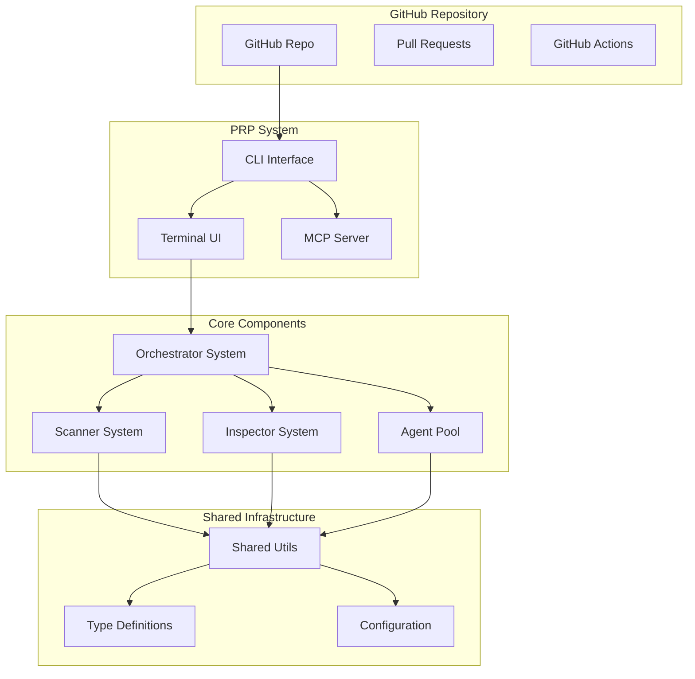
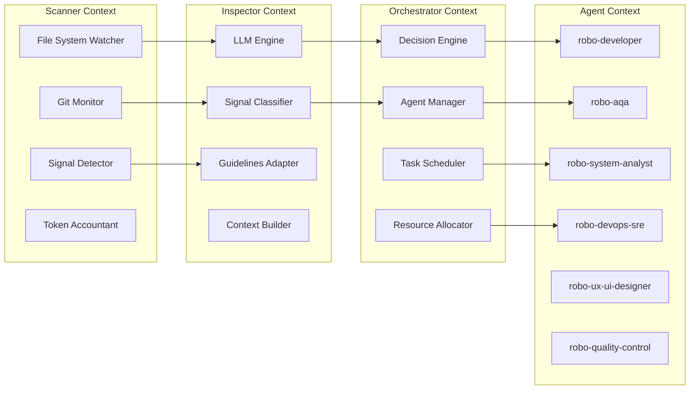
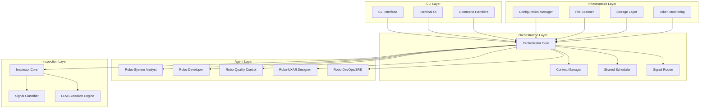

# Contributing to ♫ @dcversus/prp

Thank you for your interest in contributing to PRP (Product Requirement Prompts) - Autonomous Development Orchestration, scored to code.

## 🚀 Quick Start

### Prerequisites

- **Node.js** >= 20.11.0
- **npm** >= 10.0.0
- **Git** with proper configuration

### Setup Steps

```bash
# 1. Fork and clone the repository
git clone https://github.com/YOUR_USERNAME/prp.git
cd prp

# 2. Install dependencies
npm install

# 3. Build the project
npm run build

# 4. Run tests to verify setup
npm test

# 5. Start development
npm run dev
```

## 📋 Development Workflow

### 1. Create a Feature Branch

```bash
git checkout -b feature/your-feature-name
# or
git checkout -b fix/issue-number-description
```

### 2. Make Your Changes

- Follow the existing code style and patterns
- Add tests for new functionality
- Update documentation as needed
- Ensure all linting rules pass

### 3. Test Your Changes

```bash
# Run type checking
npm run typecheck

# Run linting
npm run lint

# Run tests
npm test

# Run test coverage
npm run test:coverage
```

### 4. Commit Your Changes

We follow [Conventional Commits](https://www.conventionalcommits.org/) specification:

```
feat: add new feature
fix: resolve issue description
docs: update documentation
style: code formatting changes
refactor: code refactoring
test: add or update tests
chore: maintenance tasks
```

### 5. Create a Pull Request

- Provide a clear description of changes
- Link related issues using `#issue-number`
- Include screenshots for UI changes
- Ensure CI checks pass

## 🏗️ Architecture Overview

### C4 Model Context



### Bounded Contexts



### Domain-Driven Design (DDD) Concepts

#### Core Entities

- **PRP (Product Requirement Prompt)**: The central artifact containing requirements, progress, and signals
- **Signal**: A two-letter code representing a state or event in the development workflow
- **Agent**: A specialized AI worker with specific capabilities and roles
- **Worktree**: An isolated git worktree for each PRP

#### Value Objects

- **SignalPriority**: 1-10 priority level for signals
- **AgentConfiguration**: Complete agent setup including limits and capabilities
- **TokenUsage**: Measurement of token consumption across the system

#### Aggregates

- **PRPAggregate**: Manages PRP lifecycle, signals, and related tasks
- **AgentAggregate**: Handles agent spawning, monitoring, and resource management
- **SignalAggregate**: Processes signal detection, classification, and routing

#### Domain Services

- **SignalClassificationService**: Classifies and prioritizes signals
- **TokenAccountingService**: Tracks token usage across all components
- **WorktreeManagementService**: Manages git worktrees for isolation

## 📁 Project Structure

```
prp/
├── src/                          # Source code
│   ├── agents/                   # Agent implementations
│   │   ├── agent-lifecycle-manager.ts
│   │   ├── agent-spawner.ts
│   │   ├── robo-*.ts            # Specific agent implementations
│   │   └── __tests__/            # Agent tests
│   ├── audio/                    # Audio feedback system
│   ├── commands/                 # CLI commands
│   │   ├── init.ts
│   │   ├── orchestrator.ts
│   │   └── tui-init.ts
│   ├── config/                   # Configuration management
│   ├── guidelines/               # Signal resolution guidelines
│   ├── inspector/                # Inspector system
│   ├── mcp/                      # Model Context Protocol
│   ├── orchestrator/             # Orchestrator system
│   ├── scanner/                  # Scanner system
│   ├── shared/                   # Shared utilities
│   │   ├── utils/
│   │   ├── tools/
│   │   ├── types/
│   │   └── ...
│   └── tui/                      # Terminal UI components
├── tests/                        # Test files
│   ├── e2e/                      # End-to-end tests
│   ├── integration/              # Integration tests
│   └── unit/                     # Unit tests
├── PRPs/                         # Product Requirement Prompts
├── templates/                    # Project templates
├── docs/                         # Documentation
└── scripts/                      # Build and utility scripts
```

### Component Responsibilities

#### Scanner System (`src/scanner/`)

- Monitors file system changes
- Tracks git commits and branches
- Detects signals in PRP files
- Manages token accounting

#### Inspector System (`src/inspector/`)

- Processes signals with LLM
- Classifies signal priority and context
- Prepares data for orchestrator
- Manages parallel execution

#### Orchestrator System (`src/orchestrator/`)

- Makes autonomous decisions
- Spawns and manages agents
- Coordinates parallel work
- Tracks overall progress

#### Agent System (`src/agents/`)

- Specialized AI workers
- Role-based task execution
- Token limit management
- Health monitoring

## 🔧 API Reference

### Core CLI Commands

#### `prp init`

Initialize a new PRP project.

```bash
prp init [project-name] [options]

Options:
  -p, --prompt <string>        Project base prompt
  -n, --project-name <string>  Project name
  -t, --template <type>        Project template
  --default                     Use default options
  --force                       Overwrite existing files
  --ci                          Run in CI mode
```

#### `prp orchestrator`

Start the orchestrator with TUI.

```bash
prp orchestrator [options]

Options:
  -p, --prompt <string>        Orchestrator prompt
  -c, --config <path>          Configuration file
  -l, --limit <string>         Resource limits
  -s, --screen <mode>          Screen mode (o|i|a|1|n)
  --debug                       Enable debug mode
  --ci                          Run without TUI
  --mcp-port <port>             Start MCP server
```

### MCP API

#### Authentication

All MCP requests require JWT authentication:

```bash
# Generate API key
node dist/cli.js mcp generate-key

# Start MCP server
API_SECRET=your-secret node dist/cli.js mcp start --port 8080
```

#### Endpoints

##### GET `/health`

Health check endpoint.

```json
{
  "status": "healthy",
  "timestamp": "2024-01-01T00:00:00.000Z",
  "version": "0.4.9"
}
```

##### POST `/mcp/message`

Send message to orchestrator.

```json
{
  "message": "Create a new feature",
  "prp": "PRP-001-comprehensive-cleanup",
  "priority": 8
}
```

##### GET `/mcp/status`

Get system status.

```json
{
  "agents": [
    {
      "id": "agent-1",
      "type": "robo-developer",
      "status": "active",
      "prp": "PRP-001-comprehensive-cleanup"
    }
  ],
  "signals": [
    {
      "type": "dp",
      "priority": 7,
      "prp": "PRP-001-comprehensive-cleanup",
      "description": "Development progress"
    }
  ]
}
```

### Agent API

#### Spawn Agent

```typescript
interface SpawnRequest {
  agentType: string;
  task: string | AgentTask;
  priority: number;
  timeout?: number;
  waitForHealth?: boolean;
  tokenTracking?: boolean;
}

interface SpawnResult {
  success: boolean;
  agentId: string;
  instance: AgentInstance;
  executionResult?: AgentExecutionResult;
  spawnTime: number;
  executionTime?: number;
}
```

#### Agent Configuration

```typescript
interface AgentConfig {
  id: string;
  type: 'claude' | 'codex' | 'custom';
  provider: string;
  limit: string;
  instructions_path: string;
  sub_agents?: boolean | string[];
  tools: ToolDefinition[];
  compact_prediction: {
    percent_threshold: number;
    cap?: number;
    auto_adjust: boolean;
  };
}
```

## 🧪 Testing Guide

### Test Structure

- **Unit Tests** (`tests/unit/`): Test individual functions and classes
- **Integration Tests** (`tests/integration/`): Test component interactions
- **E2E Tests** (`tests/e2e/`): Test complete workflows

### Writing Tests

#### Unit Test Example

```typescript
import { SignalDetector } from '../src/scanner/signal-detector';

describe('SignalDetector', () => {
  it('should detect signals in PRP content', () => {
    const detector = new SignalDetector();
    const content = '# Test PRP\n[dp] Development progress';
    const signals = detector.detectSignals(content);

    expect(signals).toContainEqual({
      type: 'dp',
      line: 2,
      content: 'Development progress',
      priority: 7,
    });
  });
});
```

#### E2E Test Example

```typescript
import { execSync } from 'child_process';
import { existsSync } from 'fs';
import path from 'path';

describe('CLI E2E', () => {
  it('should initialize a new project', () => {
    const testDir = '/tmp/prp-test-' + Date.now();

    execSync(`node dist/cli.js init ${testDir} --default --template typescript`);

    expect(existsSync(path.join(testDir, 'package.json'))).toBe(true);
    expect(existsSync(path.join(testDir, 'src/index.ts'))).toBe(true);
    expect(existsSync(path.join(testDir, 'README.md'))).toBe(true);
  });
});
```

### Running Tests

```bash
# Run all tests
npm test

# Run specific test file
npm test -- signal-detector.test.ts

# Run tests with coverage
npm run test:coverage

# Run E2E tests
npm run test:e2e

# Run performance tests
npm run test:performance
```

## 🎨 Signal System

### Signal Types

| Signal | Name                    | Priority | Description                 |
| ------ | ----------------------- | -------- | --------------------------- |
| [HF]   | Health Feedback         | 10       | System health check         |
| [AA]   | Admin Attention         | 10       | Requires admin intervention |
| [FF]   | Fatal Error             | 10       | System failure              |
| [BB]   | Blocker                 | 9        | Technical blocker           |
| [af]   | Feedback                | 8        | Request feedback            |
| [gg]   | Goal Clarification      | 8        | Clarify requirements        |
| [dp]   | Development Progress    | 7        | Implementation progress     |
| [pr]   | Pull Request            | 7        | GitHub activity             |
| [rc]   | Research Complete       | 6        | Research finished           |
| [tw]   | Tests Written           | 5        | Tests implemented           |
| [bf]   | Bug Fixed               | 5        | Issue resolved              |
| [cq]   | Code Quality            | 4        | Quality check passed        |
| [cp]   | CI Passed               | 4        | Pipeline success            |
| [da]   | Done Assessment         | 3        | Ready for review            |
| [iv]   | Implementation Verified | 2        | Manual verification         |
| [mg]   | Merged                  | 2        | Code merged                 |
| [rl]   | Released                | 1        | Deployment complete         |
| [ps]   | Post-release Status     | 1        | Production check            |

### Signal Resolution Protocol

1. **Detection**: Scanner identifies signal in PRP or logs
2. **Classification**: Inspector analyzes and prioritizes
3. **Dispatch**: Orchestrator assigns to appropriate agent
4. **Resolution**: Agent executes task
5. **Verification**: QC validates result
6. **Completion**: Signal marked as resolved

## 🚦 Quality Gates

### Pre-commit Checklist

- [ ] All tests pass (`npm test`)
- [ ] No linting errors (`npm run lint`)
- [ ] No TypeScript errors (`npm run typecheck`)
- [ ] Code follows project conventions
- [ ] Documentation updated
- [ ] CHANGELOG.md updated
- [ ] PRP files updated with progress

### Code Review Process

1. **Automated Checks**
   - CI/CD pipeline runs
   - Test coverage measured
   - Code quality validated

2. **Human Review**
   - Architecture alignment
   - Signal system usage
   - Performance implications
   - Security considerations

3. **Approval**
   - At least one maintainer approval
   - All discussions resolved
   - PR ready to merge

## 📝 Documentation Standards

### Code Documentation

````typescript
/**
 * Signal detector for PRP content analysis
 *
 * Scans PRP files for signal patterns and extracts structured data.
 * Supports real-time monitoring and batch processing modes.
 *
 * @example
 * ```typescript
 * const detector = new SignalDetector();
 * const signals = detector.scanFile('PRP-001-comprehensive-cleanup.md');
 * console.log(`Found ${signals.length} signals`);
 * ```
 */
export class SignalDetector {
  /**
   * Scan content for signal patterns
   * @param content - Text content to scan
   * @param options - Scan configuration options
   * @returns Array of detected signals
   */
  scan(content: string, options?: ScanOptions): Signal[] {
    // Implementation
  }
}
````

### PRP Documentation

Each PRP must follow this structure:

```markdown
# PRP-XXX: [Title]

> User requirement quote (READ-ONLY)

## Feature Name

Brief description of implementation approach.

- `/src/file.ts` | Current status and next steps [signal]
- [ ] Checklist item with verification link
- [ ] Another checklist item

## Definition of Ready (DoR)

- [ ] Requirements clarified
- [ ] Implementation plan ready
- [ ] Dependencies identified

## Definition of Done (DoD)

- [ ] Code implemented
- [ ] Tests written and passing
- [ ] Documentation updated
- [ ] Code review completed
- [ ] Deployed to production
```

## 🤝 Community Guidelines

### Code of Conduct

- Be respectful and inclusive
- Welcome newcomers and help them learn
- Focus on constructive feedback
- Assume good intentions

### Getting Help

- **Discord**: [Community channel](https://discord.gg/prp)
- **GitHub Issues**: [Bug reports](https://github.com/dcversus/prp/issues)
- **Documentation**: [Complete guide](https://docs.prp.dev)

### Release Process

1. **Preparation**
   - All PRs merged to `main`
   - Tests passing
   - Documentation updated

2. **Version Bump**

   ```bash
   npm version patch|minor|major
   ```

3. **Release**

   ```bash
   npm run build:prod
   npm publish
   ```

4. **Post-release**
   - Monitor for issues
   - Update documentation
   - Announce release

## 🙏 Acknowledgments

Thank you to all contributors who help make PRP better!

- Core maintainers: @dcversus
- All contributors: [Contributors list](https://github.com/dcversus/prp/graphs/contributors)

---

For questions or support, please open an issue or reach out on Discord.

### Prerequisites

- **Node.js**: 20.11.0+ (required)
- **npm**: 10.0.0+ (required)
- **Git**: Latest version
- **Editor**: VS Code with TypeScript and ESLint extensions recommended

### Quick Start

```bash
# Clone the repository
git clone https://github.com/dcversus/prp.git
cd prp

# Install dependencies
npm install

# Run development mode
npm run dev

# Run tests
npm test

# Build the project
npm run build
```

### Development Commands

```bash
npm run dev          # Start development with watch mode
npm run build        # Build the project
npm run test         # Run all tests
npm run lint         # Run ESLint
npm run format       # Format code with Prettier
npm run validate     # Run typecheck + lint + test
npm run fix          # Auto-fix linting and formatting
```

## 📊 Architecture Overview

### C4 Model: Bounded Contexts



### Domain-Driven Design (DDD) Terminology

#### Core Concepts

- **PRP (Product Requirement Prompt)**: Primary artifact for defining development requirements
- **Signal System**: Communication protocol between agents using standardized signal codes
- **Agent**: Specialized AI entity with specific responsibilities (analyst, developer, QA, etc.)
- **Orchestrator**: Central coordinator managing agent workflows and resource allocation
- **Inspector**: Quality assurance component for signal classification and validation

#### Bounded Contexts

1. **CLI Context**: Command-line interface and user interaction
2. **Orchestration Context**: Agent coordination and workflow management
3. **Agent Context**: Individual agent behaviors and responsibilities
4. **Inspection Context**: Signal processing and quality validation
5. **Infrastructure Context**: Core services and utilities

#### Domain Entities

- **ProductRequirementPrompt**: Main requirement definition entity
- **Signal**: Standardized communication message
- **Agent**: Autonomous development participant
- **Workflow**: Coordinated sequence of agent activities
- **Context**: Runtime environment and state management

## 📁 File Structure & Responsibility Areas

```
prp/
├── src/
│   ├── agents/                    # Agent implementations
│   │   ├── robo-system-analyst.ts # Requirements analysis & PRP creation
│   │   ├── robo-developer.ts      # Code implementation & development
│   │   ├── robo-quality-control.ts# Testing & quality assurance
│   │   ├── robo-ux-ui-designer.ts # UI/UX design & prototyping
│   │   └── robo-devops-sre.ts     # DevOps & infrastructure management
│   │
│   ├── orchestrator/              # Orchestration layer
│   │   ├── orchestrator.ts        # Main orchestrator implementation
│   │   ├── context-manager.ts     # Context and state management
│   │   ├── signal-router.ts       # Signal routing & processing
│   │   └── shared-scheduler.ts    # Task scheduling & resource allocation
│   │
│   ├── inspector/                 # Inspection & validation layer
│   │   ├── inspector.ts           # Main inspector implementation
│   │   ├── signal-classifier.ts   # Signal classification logic
│   │   ├── llm-executor.ts        # LLM execution engine
│   │   └── enhanced-inspector.ts  # Enhanced inspection capabilities
│   │
│   ├── scanner/                   # File system monitoring
│   │   ├── scanner.ts             # File scanning & monitoring
│   │   ├── signal-detector.ts     # Signal detection in files
│   │   └── token-accountant.ts    # Token usage tracking
│   │
│   ├── config/                    # Configuration management
│   │   ├── agent-config.ts        # Agent configuration
│   │   ├── manager.ts             # Configuration manager
│   │   └── schema-validator.ts    # Configuration validation
│   │
│   ├── commands/                  # CLI command implementations
│   │   ├── init.ts                # Project initialization
│   │   ├── orchestrator.ts        # Orchestration commands
│   │   └── tui-init.ts            # TUI initialization
│   │
│   ├── tui/                       # Terminal User Interface
│   │   ├── components/            # React components for CLI
│   │   ├── screens/               # TUI screen implementations
│   │   └── hooks/                 # Custom React hooks
│   │
│   ├── shared/                    # Shared utilities and types
│   │   ├── types.ts               # Global type definitions
│   │   ├── utils/                 # Utility functions
│   │   ├── config.ts              # Shared configuration
│   │   └── events.ts              # Event system
│   │
│   ├── audio/                     # Audio feedback system
│   │   ├── signal-orchestra.ts    # Signal-to-audio mapping
│   │   └── audio-feedback-manager.ts # Audio feedback management
│   │
│   └── cli.ts                     # Main CLI entry point
│
├── PRPs/                          # Product Requirement Prompts
│   ├── PRP-000-agents05.md        # Agent orchestration system
│   ├── PRP-001-comprehensive-cleanup.md # Comprehensive codebase cleanup
│   ├── PRP-002-landing-page-deployed.md # Landing page deployment
│   └── ...                       # Additional PRPs for each feature
│
├── tests/                         # Test suites
│   ├── unit/                      # Unit tests (70%)
│   ├── e2e/                       # End-to-end tests (30%)
│   ├── integration/               # Integration tests
│   └── helpers/                   # Test utilities
│
├── templates/                     # Project templates
│   ├── react/                     # React project template
│   ├── fastapi/                   # FastAPI template
│   └── wikijs/                    # Wiki.js template
│
├── docs/                          # Documentation
├── scripts/                       # Build and utility scripts
└── examples/                      # Usage examples
```

### Responsibility Areas

#### Agent Layer

- **Robo-System Analyst**: Requirements gathering, PRP creation, stakeholder communication
- **Robo-Developer**: Code implementation, feature development, technical solutions
- **Robo-Quality Control**: Testing, quality assurance, validation
- **Robo-UX/UI Designer**: User interface design, UX research, prototyping
- **Robo-DevOps/SRE**: Infrastructure, deployment, monitoring, reliability

#### Infrastructure Layer

- **Configuration**: Agent and system configuration management
- **Scanner**: File system monitoring and signal detection
- **Shared**: Common utilities, types, and cross-cutting concerns

#### Orchestration Layer

- **Orchestrator**: Agent coordination and workflow management
- **Context Manager**: Runtime state and context management
- **Signal Router**: Inter-agent communication routing

## 🔗 Feature References (PRPs)

### Core Features

- **Agent System**: [PRP-000-agents05.md](./PRPs/PRP-000-agents05.md) - AI agent orchestration
- **Comprehensive Cleanup**: [PRP-001-comprehensive-cleanup.md](./PRPs/PRP-001-comprehensive-cleanup.md) - Codebase cleanup and organization
- **Landing Page**: [PRP-002-landing-page-deployed.md](./PRPs/PRP-002-landing-page-deployed.md) - Web interface
- **TUI Implementation**: [PRP-003-tui-implementation.md](./PRPs/PRP-003-tui-implementation.md) - Terminal UI

## 🛠 API Details

### Core APIs

#### CLI API

```typescript
// Main CLI interface
interface CLIOptions {
  command: string;
  subcommand?: string;
  options: Record<string, any>;
  prp?: string; // Product Requirement Prompt
}

// Command execution
export async function executeCommand(options: CLIOptions): Promise<void>;
```

#### Agent API

```typescript
// Base agent interface
interface Agent {
  name: string;
  type: AgentType;
  execute(task: Task, context: Context): Promise<Result>;
  communicate(signal: Signal, recipient?: Agent): Promise<void>;
}

// Agent types
enum AgentType {
  SYSTEM_ANALYST = 'robo-system-analyst',
  DEVELOPER = 'robo-developer',
  QUALITY_CONTROL = 'robo-quality-control',
  UX_UI_DESIGNER = 'robo-ux-ui-designer',
  DEVOPS_SRE = 'robo-devops-sre',
}
```

#### Orchestrator API

```typescript
// Main orchestrator interface
interface Orchestrator {
  coordinateWorkflow(prp: ProductRequirementPrompt): Promise<void>;
  assignTask(agent: Agent, task: Task): Promise<void>;
  routeSignal(signal: Signal): Promise<void>;
  monitorProgress(): Promise<WorkflowStatus>;
}
```

#### Signal System API

```typescript
// Signal structure
interface Signal {
  code: string; // e.g., '[gg]', '[da]', '[bb]'
  agent: string; // Agent identifier
  message: string; // Signal message
  timestamp: Date; // When signal was emitted
  context?: any; // Additional context
}

// Signal processing
export class SignalProcessor {
  process(signal: Signal): Promise<void>;
  route(signal: Signal): Promise<void>;
  validate(signal: Signal): boolean;
}
```

### Configuration API

```typescript
// Agent configuration
interface AgentConfig {
  name: string;
  type: AgentType;
  capabilities: string[];
  llmConfig: LLMConfig;
  tools: ToolConfig[];
}

// Project configuration
interface ProjectConfig {
  name: string;
  template: string;
  agents: AgentConfig[];
  orchestrator: OrchestratorConfig;
  signalSettings: SignalConfig;
}
```

## 🤝 How to Contribute

### 1. Setting Up Your Development Environment

```bash
# Fork the repository
git clone https://github.com/YOUR_USERNAME/prp.git
cd prp

# Add upstream remote
git remote add upstream https://github.com/dcversus/prp.git

# Install dependencies
npm install

# Create development branch
git checkout -b feature/your-feature-name
```

### 2. Understanding the Workflow

#### PRP-First Development

1. **Read the PRP**: Always start by reading the relevant PRP file for the feature you're working on
2. **Understand Requirements**: Identify specific requirements and acceptance criteria
3. **Signal-Based Communication**: Use the signal system for progress tracking and coordination
4. **Update File List**: Maintain file lists in PRPs to track work progress

#### Signal System Usage

- Use signals defined in [AGENTS.md](./AGENTS.md) for all communication
- Update PRP files with progress signals after completing tasks
- Coordinate with other agents using appropriate signals
- Document blockers and dependencies with specific signals

### 3. Making Changes

#### Code Standards

- **TypeScript**: All code must be written in TypeScript
- **ESLint**: Must pass all ESLint checks
- **Prettier**: Code must be formatted with Prettier
- **Tests**: New features must include appropriate tests
- **Documentation**: Update documentation for API changes

#### File Organization

- Follow the established file structure
- Keep files focused on single responsibilities
- Use clear, descriptive naming conventions
- Add appropriate TypeScript types and interfaces

#### Testing Strategy

```typescript
// Example test structure
describe('Feature Name', () => {
  describe('Unit Tests', () => {
    it('should handle basic functionality', () => {
      // Test implementation
    });
  });

  describe('Integration Tests', () => {
    it('should integrate with other components', () => {
      // Integration test
    });
  });

  describe('E2E Tests', () => {
    it('should work end-to-end', () => {
      // E2E test in /tmp or /debug
    });
  });
});
```

### 4. Opening Pull Requests

#### PR Requirements

1. **Branch Naming**: Use `feature/`, `bugfix/`, `hotfix/` prefixes
2. **Commit Messages**: Follow conventional commit format
3. **PR Description**: Include:
   - Clear description of changes
   - Reference to relevant PRP(s)
   - Testing approach
   - Breaking changes (if any)
   - Performance impact (if any)

#### PR Template

```markdown
## Description

Brief description of the changes made.

## Related PRP(s)

- [PRP-XXX](link to PRP file)

## Changes Made

- List of specific changes
- New files added
- Files modified/removed

## Testing

- Unit tests: [x] Passing
- Integration tests: [x] Passing
- E2E tests: [x] Passing
- Manual testing: [x] Completed

## Performance Impact

- CLI startup: <2s target
- Memory usage: <50MB target
- Any performance concerns

## Breaking Changes

List any breaking changes and migration steps.

## Checklist

- [ ] Code follows style guidelines
- [ ] Self-review completed
- [ ] Documentation updated
- [ ] Tests added/updated
- [ ] All tests passing
- [ ] PRP updated with progress signals
```

### 5. Automated Review Process

#### CI/CD Pipeline

1. **Pre-commit Hooks**:
   - ESLint checks
   - Prettier formatting
   - Type checking

2. **CI Pipeline**:
   - Full test suite execution
   - Coverage reporting (minimum 80%)
   - Performance benchmarks
   - Security scans

3. **Quality Gates**:
   - All tests must pass
   - Coverage threshold met
   - Performance benchmarks met
   - No security vulnerabilities

#### Automated Checks

```yaml
# Example CI configuration
name: PRP Quality Gates
on: [pull_request]

jobs:
  quality-check:
    runs-on: ubuntu-latest
    steps:
      - name: Checkout code
        uses: actions/checkout@v3

      - name: Setup Node.js
        uses: actions/setup-node@v3
        with:
          node-version: '20'
          cache: 'npm'

      - name: Install dependencies
        run: npm ci

      - name: Run tests
        run: npm run test:coverage

      - name: Run performance tests
        run: npm run test:performance

      - name: Security audit
        run: npm audit --audit-level=moderate
```

### 6. Code Review Process

#### Review Guidelines

1. **Technical Review**: Focus on code quality, architecture, and best practices
2. **Functional Review**: Verify requirements from PRP are met
3. **Performance Review**: Ensure performance standards are met
4. **Security Review**: Check for security implications

#### Review Checklist

- [ ] Code follows project conventions
- [ ] TypeScript types are correct and thorough
- [ ] Error handling is appropriate
- [ ] Performance implications considered
- [ ] Security best practices followed
- [ ] Tests are comprehensive and accurate
- [ ] Documentation is clear and complete
- [ ] PRP signals are updated correctly

## 🏆 Credit Attribution

### Contribution Recognition

We believe in recognizing all contributions fairly and transparently.

#### Types of Contributions

1. **Code Contributions**: New features, bug fixes, improvements
2. **Documentation**: Docs, guides, examples
3. **Testing**: Test cases, test infrastructure
4. **Design**: UI/UX design, graphics
5. **Community**: Support, feedback, ideas

#### Attribution Guidelines

- **Code**: Include your name/email in commits and PR descriptions
- **Documentation**: Add yourself to contributors list in relevant docs
- **Ideas**: Mention originators in PRP references
- **Reviews**: Acknowledge significant review contributions

#### Contributors Section

```markdown
## Contributors

### Core Team

- **Vasilisa Versus** - Project creator and maintainer
- [Add other core team members]

### Feature Contributors

- **Your Name** - [Feature/Contribution description] ([PR #123]())

### Documentation Contributors

- **Your Name** - [Documentation contribution]

### Community Contributors

- **Your Name** - [Community contribution, feedback, testing]
```

#### Credit in PRPs

When contributing to features, ensure proper attribution in PRP files:

```markdown
## Implementation Details

- **Original implementation**: [Your Name] - [Date]
- **Contributors**: [List of contributors with specific contributions]
- **Based on**: [Previous work or inspiration]
```

## 📞 Getting Help

### Communication Channels

- **GitHub Issues**: For bug reports and feature requests
- **GitHub Discussions**: For general questions and community discussions
- **PRP System**: For detailed development coordination

### Resources

- [AGENTS.md](./AGENTS.md) - Agent guidelines and signal system
- [docs/](./docs/) - Additional documentation
- [examples/](./examples/) - Usage examples
- [PRPs/](./PRPs/) - Feature requirements and implementation details

### Common Issues

1. **Build Failures**: Check Node.js version (20.11.0+) and run `npm install`
2. **Test Failures**: Ensure all dependencies are installed and run `npm run validate`
3. **TypeScript Errors**: Run `npm run typecheck` for detailed error information
4. **Performance Issues**: Use `npm run test:performance` to benchmark

## 🎯 Development Best Practices

### Signal-Driven Development

1. **Always read PRP first** - Understand requirements before implementation
2. **Use signals for progress** - Update PRP files with appropriate signals
3. **Coordinate with agents** - Use signal system for inter-agent communication
4. **Document blockers** - Use `[bb]` signal for blocking issues

### Quality Standards

1. **Test Coverage**: Minimum 80% coverage for new code
2. **Performance**: CLI startup < 2s, memory usage < 50MB
3. **TypeScript**: Strict typing, no `any` types unless absolutely necessary
4. **Documentation**: Document all public APIs and complex logic

### Code Organization

1. **Single Responsibility**: Each file/module should have one clear purpose
2. **Dependency Management**: Minimize external dependencies
3. **Error Handling**: Implement comprehensive error handling
4. **Logging**: Use structured logging for debugging and monitoring

## 📡 Working with Signals

**PRP uses a Signal System to track progress and communicate state.**

### What is a Signal?

A **signal** is an emotional/status indicator that tells other agents and contributors what state the work is in. Every PRP progress log entry must include a signal.

### How to Leave a Signal

When updating a PRP Progress Log, add a signal in the last column:

```markdown
| Role      | DateTime   | Comment                                     | Signal       |
| --------- | ---------- | ------------------------------------------- | ------------ |
| developer | 2025-10-28 | Implemented auth module, all tests passing. | ✅ CONFIDENT |
```

### Common Signals

- **🔴 ATTENTION** (10) - Need user input or new PRP created
- **🚫 BLOCKED** (9) - Cannot proceed, external dependency needed
- **🚨 URGENT** (9) - Time-sensitive, immediate action required
- **😫 TIRED** (6) - Work incomplete, needs inventory
- **✅ CONFIDENT** (3) - Work complete, ready for review
- **🎯 VALIDATED** (2) - Reviewed and approved
- **🏁 COMPLETED** (1) - DoD met, PRP done

**Full signal reference**: See [AGENTS.md](AGENTS.md#signal-system)

### How to Read Signals

**Before starting work on a PRP**:

1. Read the entire PRP
2. Check Progress Log for latest signal
3. React to strongest signal (highest strength number)
4. Follow the signal's algorithm (see AGENTS.md)

**Example**:

- If you see **BLOCKED** → Check blocker details, see if you can resolve it
- If you see **TIRED** → Review inventory, continue where left off
- If you see **CONFIDENT** → Review work, create PR if ready

## Code Style

### TypeScript

- Use strict mode (no `any` unless absolutely necessary)
- Prefer interfaces over types for object shapes
- Use meaningful variable and function names
- Add JSDoc comments for public APIs

### React Components (Ink)

- Use functional components with hooks
- Properly type all props
- Keep components small and focused
- Extract reusable logic to custom hooks

### File Naming

- TypeScript files: `camelCase.ts`
- React components: `PascalCase.tsx`
- Test files: `*.test.ts` or `*.test.tsx`

### Commit Messages

Follow [Conventional Commits](https://www.conventionalcommits.org/):

```
<type>(<scope>): <subject>

<body>

<footer>
```

**Types:**

- `feat`: New feature
- `fix`: Bug fix
- `docs`: Documentation changes
- `style`: Code style changes (formatting, etc.)
- `refactor`: Code refactoring
- `test`: Adding or updating tests
- `chore`: Maintenance tasks

**Examples:**

```
feat(generators): add Vue.js template support
fix(ui): correct spinner positioning in progress view
docs(readme): update installation instructions
test(generators): add tests for React template
```

## Testing

### Writing Tests

- Place tests next to the code they test or in `tests/` directory
- Use descriptive test names
- Follow AAA pattern (Arrange, Act, Assert)
- Mock external dependencies

```typescript
describe('generateProject', () => {
  it('should create project directory with correct structure', async () => {
    // Arrange
    const options = { name: 'test-app', template: 'react' };
    const targetPath = '/tmp/test-app';

    // Act
    await generateProject(options, targetPath);

    // Assert
    expect(fs.existsSync(targetPath)).toBe(true);
    expect(fs.existsSync(path.join(targetPath, 'package.json'))).toBe(true);
  });
});
```

### Running Tests

```bash
# Run all tests
npm test

# Run specific test file
npm test -- generators/react.test.ts

# Run tests in watch mode
npm run test:watch

# Generate coverage report
npm run test:coverage
```

## Documentation

### Code Documentation

All public functions, classes, and interfaces should have JSDoc comments:

```typescript
/**
 * Generates a new project based on provided options.
 *
 * @param options - Project configuration options
 * @param targetPath - Directory where project will be created
 * @returns Promise that resolves when generation is complete
 * @throws {Error} If target directory already exists
 */
export async function generateProject(options: ProjectOptions, targetPath: string): Promise<void> {
  // Implementation
}
```

### README Updates

When adding features:

- Update the feature list
- Add usage examples
- Update command-line options
- Add to supported templates if applicable

### CHANGELOG Updates

All changes should be documented in CHANGELOG.md under the `[Unreleased]` section:

```markdown
## [Unreleased]

### Added

- New Vue.js template support

### Changed

- Improved error messages in interactive mode

### Fixed

- Fixed incorrect file permissions on generated scripts
```

## Adding New Templates

To add support for a new project template:

1. Create template directory: `src/templates/<template-name>/`
2. Add template files with Handlebars placeholders
3. Create generator: `src/generators/<template-name>.ts`
4. Export from `src/generators/index.ts`
5. Add to `Template` type in `src/types.ts`
6. Update CLI in `src/cli.ts`
7. Write tests in `tests/generators/<template-name>.test.ts`
8. Update README.md

Example generator structure:

```typescript
import { GeneratorContext, FileToGenerate } from '../types.js';

export async function generateVueProject(context: GeneratorContext): Promise<FileToGenerate[]> {
  const files: FileToGenerate[] = [];

  // Add package.json
  files.push({
    path: 'package.json',
    content: generatePackageJson(context.options),
  });

  // Add other files...

  return files;
}
```

## Review Process

1. All PRs require at least one approval
2. All CI checks must pass
3. Code must follow style guidelines
4. Tests must pass with adequate coverage
5. Documentation must be updated

## License

By contributing to PRP, you agree that your contributions will be licensed under the [AGPL-3.0 License](LICENSE).

---

Thank you for contributing to PRP! 🚀
