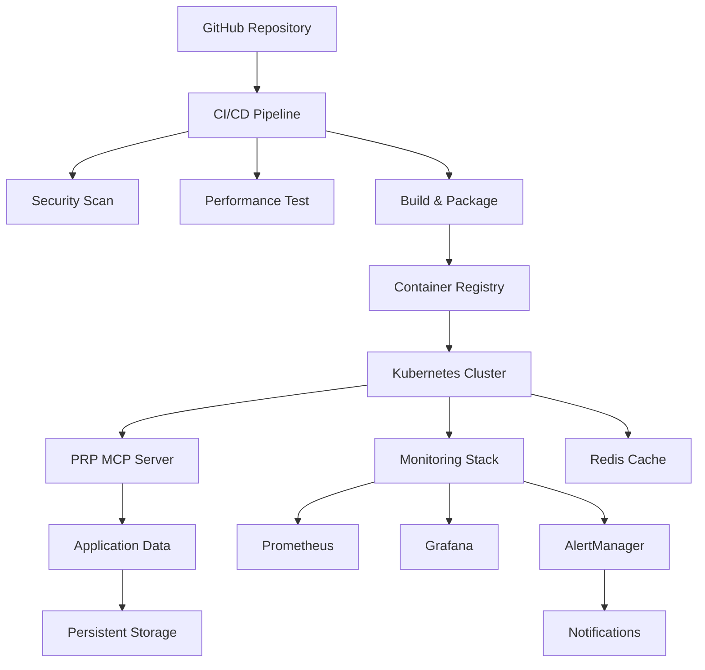

# PRP CLI Infrastructure Guide

## Overview

This guide provides comprehensive documentation for the PRP CLI autonomous development orchestration system infrastructure, including deployment, monitoring, security, and disaster recovery procedures.

## Architecture Overview

### System Components

- **PRP MCP Server**: Core orchestration service providing Model Context Protocol (MCP) endpoints
- **Kubernetes Cluster**: Container orchestration platform with multi-zone availability
- **Monitoring Stack**: Prometheus, Grafana, AlertManager for observability
- **Security Infrastructure**: Multi-layer security scanning and vulnerability management
- **CI/CD Pipeline**: Automated deployment with rollback capabilities

### High-Level Architecture



## Prerequisites

### System Requirements

- **Kubernetes**: v1.24+ with RBAC enabled
- **Docker**: v20.10+ with BuildKit support
- **Node.js**: v18.0+ for local development
- **Helm**: v3.8+ for package management
- **kubectl**: Latest version for cluster management
- **Storage**: Minimum 50GB available

### Resource Requirements

#### Minimum Cluster Resources
- **Nodes**: 3 (for high availability)
- **CPU**: 2 cores per node
- **Memory**: 4GB per node
- **Storage**: 100GB total

#### Application Resources
- **PRP MCP Server**: 100m CPU, 128Mi memory (requests)
- **Redis Cache**: 100m CPU, 256Mi memory
- **Monitoring Stack**: 500m CPU, 1Gi memory

## Deployment Guide

### 1. Environment Setup

#### Kubernetes Cluster Setup

```bash
# Create namespace
kubectl create namespace prp-system

# Apply RBAC configuration
kubectl apply -f k8s/base/rbac.yaml

# Apply secrets
kubectl apply -f k8s/base/secret.yaml
```

#### Secret Configuration

Create required secrets before deployment:

```yaml
# prp-secrets.yaml
apiVersion: v1
kind: Secret
metadata:
  name: prp-secrets
  namespace: prp-system
type: Opaque
data:
  # Base64 encoded values
  API_SECRET: <encoded-api-secret>
  REDIS_PASSWORD: <encoded-redis-password>
  JWT_SECRET: <encoded-jwt-secret>
```

### 2. Application Deployment

#### Method 1: Kustomize Deployment

```bash
# Production deployment
kubectl apply -k k8s/overlays/production/

# Staging deployment
kubectl apply -k k8s/overlays/staging/
```

#### Method 2: Docker Compose

```bash
# Set environment variables
export VERSION=0.5.0
export API_SECRET=your-secret-key
export REDIS_PASSWORD=your-redis-password

# Deploy services
docker-compose -f docker-compose.yml up -d
```

#### Method 3: Helm Charts

```bash
# Add Helm repository
helm repo add prp-cli https://charts.prp.theedgestory.org
helm repo update

# Install chart
helm install prp-cli prp-cli/prp-cli \
  --namespace prp-system \
  --set image.tag=0.5.0 \
  --set replicas=3
```

### 3. Verification

#### Health Checks

```bash
# Check pod status
kubectl get pods -n prp-system

# Check service status
kubectl get services -n prp-system

# Perform health check
kubectl port-forward -n prp-system svc/prp-mcp-server 8080:8080
curl http://localhost:8080/health
```

#### Application Validation

```bash
# Verify MCP server
curl http://localhost:8080/metrics

# Check application logs
kubectl logs -n prp-system -l app.kubernetes.io/name=prp-cli

# Verify monitoring
kubectl get pods -n monitoring
```

## Monitoring and Observability

### Prometheus Configuration

#### Metrics Collection

Prometheus collects metrics from:
- Application endpoints (`/metrics`)
- Kubernetes cluster resources
- Node exporters
- Container performance
- Custom business metrics

#### Alerting Rules

Critical alerting rules are configured for:
- Service availability
- Resource utilization (CPU, memory, disk)
- Error rates and response times
- Security incidents

#### Key Metrics

| Metric | Description | Threshold |
|--------|-------------|----------|
| CPU Usage | CPU utilization percentage | 80% |
| Memory Usage | Memory utilization percentage | 85% |
| Response Time | HTTP request duration | 2s (95th percentile) |
| Error Rate | HTTP error percentage | 5% |
| Uptime | Service availability | 99.9% |

### Grafana Dashboards

Pre-configured dashboards:
- **Application Overview**: Application metrics and KPIs
- **Infrastructure**: Cluster and node performance
- **Security**: Security events and vulnerabilities
- **Performance**: Response times and throughput

### Log Aggregation

Logs are collected and aggregated from:
- Application containers
- Kubernetes system components
- Infrastructure services

## Security Configuration

### Container Security

#### Security Context

```yaml
securityContext:
  runAsNonRoot: true
  runAsUser: 1001
  fsGroup: 1001
  allowPrivilegeEscalation: false
  readOnlyRootFilesystem: true
  capabilities:
    drop:
      - ALL
```

#### Image Security

- Multi-stage Docker builds
- Minimal base images (Alpine)
- Security scanning integration
- Signed images verification

### Network Security

#### Ingress Configuration

```yaml
apiVersion: networking.k8s.io/v1
kind: Ingress
metadata:
  annotations:
    nginx.ingress.kubernetes.io/ssl-redirect: "true"
    nginx.ingress.kubernetes.io/rate-limit: "1000"
    cert-manager.io/cluster-issuer: "letsencrypt-prod"
spec:
  tls:
    - hosts:
        - prp.theedgestory.org
      secretName: prp-tls-secret
```

### Secret Management

#### Secrets Storage

- Kubernetes Secrets for application secrets
- External secret managers (Sealed Secrets, Vault)
- Environment-specific configurations
- Rotation policies

## Backup and Disaster Recovery

### Backup Strategy

#### Automated Backups

```bash
# Run daily backups
./disaster-recovery/scripts/backup-procedure.sh

# Schedule with cron
0 2 * * * /opt/prp-cli/disaster-recovery/scripts/backup-procedure.sh
```

#### Backup Components

- **Kubernetes manifests**: All resource definitions
- **Application data**: Persistent volume contents
- **Configuration**: ConfigMaps and Secrets
- **Logs and metrics**: Historical data
- **Infrastructure**: Terraform state, Helm releases

#### Retention Policy

- **Daily backups**: Retained for 90 days
- **Weekly backups**: Retained for 6 months
- **Monthly backups**: Retained for 1 year
- **Archive storage**: Long-term offsite storage

### Disaster Recovery

#### Recovery Procedures

```bash
# Restore from backup
./disaster-recovery/scripts/restore-procedure.sh backup-file.tar.gz

# Verify restore
kubectl get pods -n prp-system
curl http://localhost:8080/health
```

#### Recovery Time Objectives (RTO)

- **Service disruption**: < 30 minutes
- **Data loss**: < 1 hour
- **Full recovery**: < 2 hours

## Performance Optimization

### Resource Tuning

#### Horizontal Pod Autoscaling

```yaml
apiVersion: autoscaling/v2
kind: HorizontalPodAutoscaler
metadata:
  name: prp-mcp-server-hpa
spec:
  minReplicas: 3
  maxReplicas: 20
  metrics:
    - type: Resource
      resource:
        name: cpu
        target:
          type: Utilization
          averageUtilization: 70
    - type: Resource
      resource:
        name: memory
        target:
          type: Utilization
          averageUtilization: 80
```

#### Performance Baselines

- **Response time**: < 200ms (95th percentile)
- **Throughput**: 1000 requests/second
- **CPU utilization**: < 70% average
- **Memory usage**: < 80% average

### Caching Strategy

#### Redis Cache Configuration

```yaml
apiVersion: v1
kind: ConfigMap
metadata:
  name: redis-config
data:
  redis.conf: |
    maxmemory 256mb
    maxmemory-policy allkeys-lru
    save 900 1
    save 300 10
    save 60 10000
```

## Troubleshooting Guide

### Common Issues

#### Pod Startup Failures

```bash
# Check pod events
kubectl describe pod -n prp-system <pod-name>

# Check logs
kubectl logs -n prp-system <pod-name>

# Check resource constraints
kubectl top pods -n prp-system
```

#### Network Connectivity

```bash
# Check service endpoints
kubectl get endpoints -n prp-system

# Test service connectivity
kubectl exec -it <pod-name> -- curl http://service-name:port

# Check network policies
kubectl get networkpolicies -n prp-system
```

#### Performance Issues

```bash
# Check resource utilization
kubectl top nodes
kubectl top pods -n prp-system

# Analyze metrics
kubectl get --raw /metrics?labels=app=prp-cli
```

### Emergency Procedures

#### Service Outage

1. **Assess Impact**
   ```bash
   kubectl get pods -n prp-system
   kubectl get events -n prp-system --sort-by='.lastTimestamp'
   ```

2. **Scale Up Resources**
   ```bash
   kubectl scale deployment prp-mcp-server -n prp-system --replicas=5
   ```

3. **Rollback Deployment**
   ```bash
   kubectl rollout undo deployment/prp-mcp-server -n prp-system
   ```

#### Data Recovery

1. **Backup Verification**
   ```bash
   ls -la /var/backups/prp-cli/
   sha256sum backup-*.tar.gz.sha256
   ```

2. **Restore from Backup**
   ```bash
   ./disaster-recovery/scripts/restore-procedure.sh backup-file.tar.gz
   ```

## Runbooks

### Incident Response Runbook

#### Severity Levels

- **Critical**: Service unavailable, data loss, security breach
- **High**: Performance degradation, partial service impact
- **Medium**: Minor issues, non-critical features affected
- **Low**: Informational alerts, documentation updates

#### Response Timeline

1. **Immediate (0-5 minutes)**: Acknowledge alert, assess impact
2. **Assessment (5-15 minutes)**: Identify root cause, determine affected systems
3. **Mitigation (15-60 minutes)**: Apply fixes, restore service
4. **Recovery (60-120 minutes)**: Verify fix, monitor stability
5. **Post-Incident**: Document lessons learned, update procedures

### Maintenance Procedures

#### Scheduled Maintenance

```bash
# Maintenance window preparation
kubectl scale deployment prp-mcp-server -n prp-system --replicas=0

# Apply maintenance
kubectl apply -f maintenance-config.yaml

# Verify maintenance
kubectl rollout status deployment/prp-mcp-server -n prp-system
```

## Security Best Practices

### Access Control

#### RBAC Configuration

- Principle of least privilege
- Service account isolation
- Namespace separation
- Regular access reviews

### Network Security

#### Network Policies

```yaml
apiVersion: networking.k8s.io/v1
kind: NetworkPolicy
metadata:
  name: prp-network-policy
spec:
  podSelector:
    matchLabels:
      app.kubernetes.io/name: prp-cli
  policyTypes:
  - Ingress
  - Egress
  ingress:
  - from:
    - namespaceSelector:
        matchLabels:
          name: prp-system
  egress:
  - to:
    - namespaceSelector:
        matchLabels:
          name: prp-system
```

### Compliance and Auditing

#### Compliance Standards

- SOC 2 Type II controls
- GDPR data protection
- PCI DSS security standards
- ISO 27001 information security

#### Audit Logging

- Authentication events
- Configuration changes
- Data access logs
- Security incidents

## Conclusion

This infrastructure guide provides comprehensive coverage of the PRP CLI deployment, including:

- System architecture and components
- Deployment procedures and verification
- Monitoring and observability setup
- Security configuration and best practices
- Backup and disaster recovery procedures
- Performance optimization and troubleshooting
- Emergency response and maintenance procedures

Regular reviews and updates to this documentation ensure it remains current with evolving infrastructure requirements and best practices.